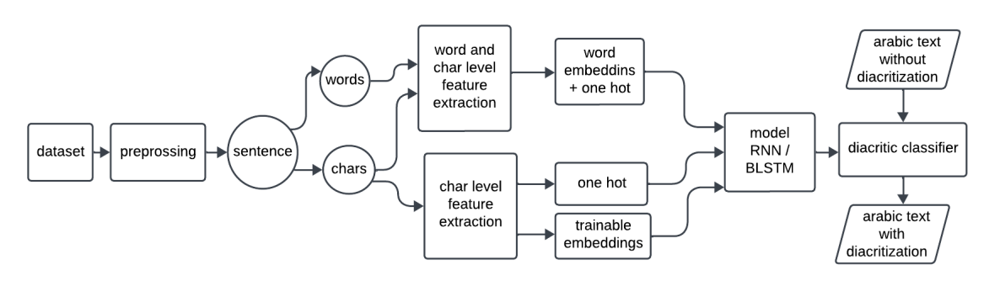
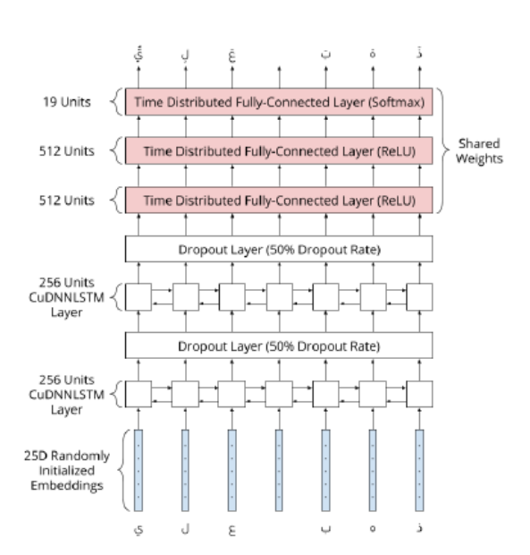
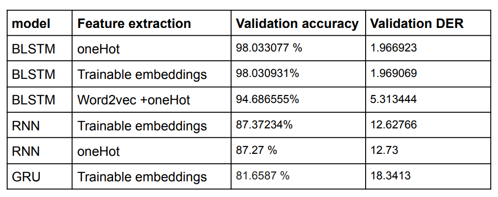
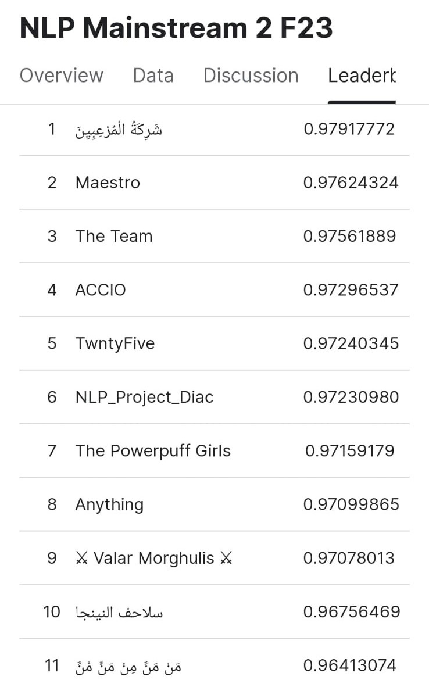
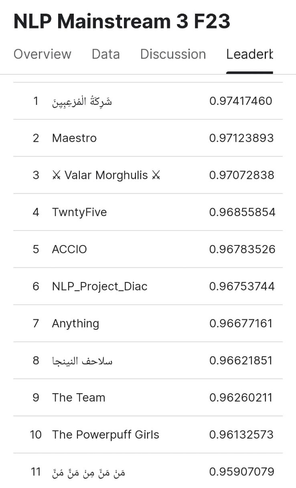
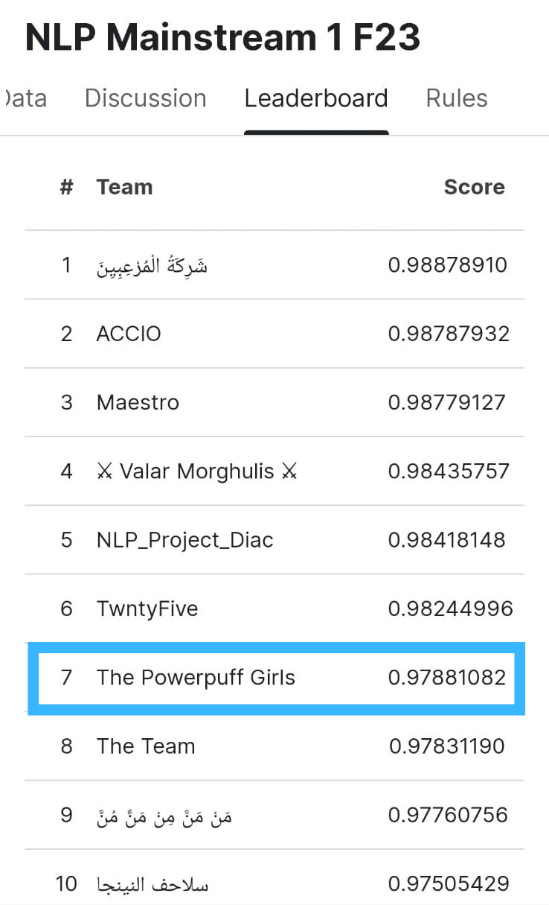
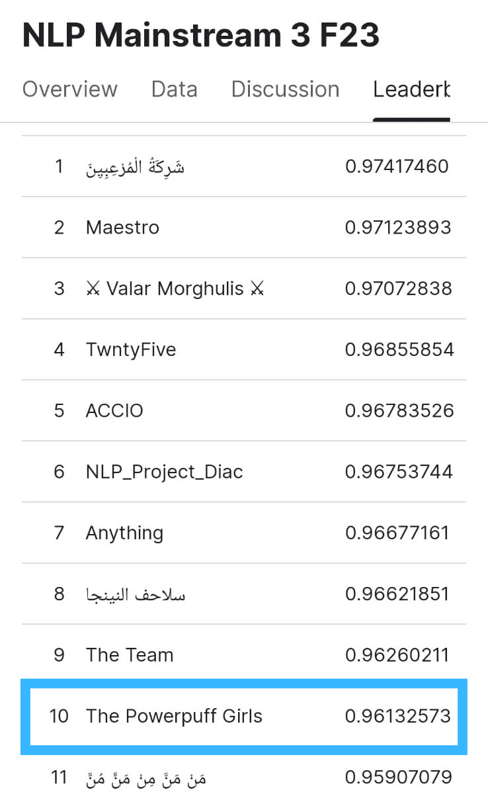

# Arabic-Text-Diacritization

## Introduction

Diacritics are short vowels with a constant length that are spoken. The same word in the Arabic language can have different meanings and different pronunciations based on how it is diacritized.

In this project, we implement a pipeline to predict the diacritic of each character in an Arabic text using Natural Language Processing techniques.

## Project Pipeline

## Project Phases
### Data Processing

- Split the sentences with punctuations.
- Split into smaller sentences of length no more than `500` characters (without
counting diacritics).
- Remove all the non-Arabic characters.
- Remove diacritics.
- Start each sentence with `<s>` and end it with `</s>`
(both will have a corresponding class ‘no diacritics’ ‘’)

### Feature extraction
- One Hot encoding `char level`
- Trainable embeddings `char level`
- Word2vec embeddings + oneHot `word and char level`

### Model
- BLSTM
- RNN

### Evaluation

`Diacritic Error Rate (DER) = 1 - Accuracy`

## Results

Final model used for the test set submission on Kaggle: **BLSTM model with char embedding layer**

`Team: The Powerpuff Girls`

<!-- 

 -->

# demo video to the deployed model

https://github.com/norhanreda/Arabic-Text-Diacritization/assets/88630231/957e03d9-2413-4c80-9397-f48874075f0e

## Contributors 

<table>
  <tr>
    <td align="center">
    <a href="https://github.com/asmaaadel0" target="_black">
    
     
    <b>Asmaa Adel</b></a>
    </td>
    <td align="center">
    <a href="https://github.com/Samaa-Hazem2001" target="_black">
    
     
    <b>Samaa Hazem</b></a>
    </td>
    <td align="center">
    <a href="https://github.com/norhanreda" target="_black">
    
     
    <b>Norhan reda</b></a>
    </td>
    <td align="center">
    <a href="https://github.com/Hoda233" target="_black">
    
     
    <b>HodaGamal</b></a>
    </td>
  </tr>
 </table>

